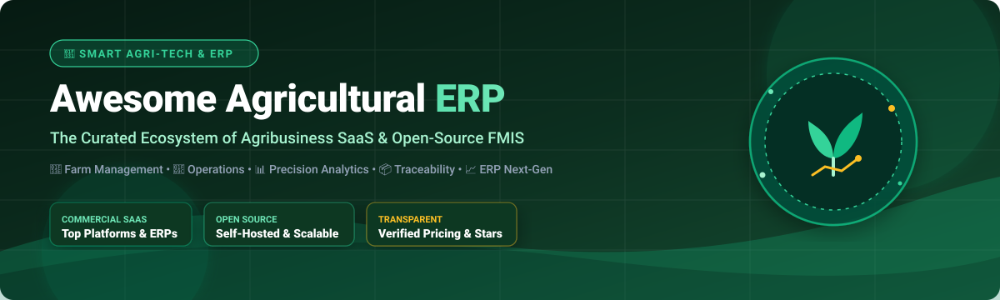

<div align="center">

<a href="https://github.com/ishandutta2007/Awesome-Agricultural-ERP"></a>

# 🌱 Awesome-Agricultural-ERP 🚜

### *A Curated Directory of Enterprise SaaS Solutions & Open-Source Farm Management Systems (FMIS)*

<p align="center">
  <a href="https://github.com/ishandutta2007/Awesome-Awesome-Awesome"></a>
  <a href="https://discord.gg/jc4xtF58Ve"></a>
  <a href="https://github.com/ishandutta2007/Awesome-Agricultural-ERP/stargazers"></a>
  <a href="https://github.com/ishandutta2007/Awesome-Agricultural-ERP/network/members"></a>
  <a href="https://github.com/ishandutta2007/Awesome-Agricultural-ERP/issues"></a>
  <a href="https://github.com/ishandutta2007/Awesome-Agricultural-ERP/blob/main/LICENSE"></a>
  <a href="https://github.com/ishandutta2007"></a>
</p>

<p align="center">
  <strong>Empowering smart agriculture, modern farm management, precision agronomy, crop &amp; livestock traceability, inventory tracking, and agribusiness enterprise resource planning (ERP).</strong>
</p>

<p align="center">
  📅 <em>Last Updated: August 2026</em>
</p>

</div>

---

## 📖 Table of Contents

- [🌾 Overview &amp; Ecosystem](#-overview--ecosystem)
- [🏢 SaaS &amp; Commercial Hosted Platforms](#-saas--commercial-hosted-platforms)
- [💻 Open-Source GitHub Projects](#-open-source-github-projects)
- [🛠️ Key Functional Modules &amp; Tech Stack](#️-key-functional-modules--tech-stack)
- [🤝 How to Contribute](#-how-to-contribute)
- [📈 Star History](#-star-history)
- [⚠️ Disclaimer](#️-disclaimer)

---

## 🌾 Overview &amp; Ecosystem

Welcome to **Awesome-Agricultural-ERP**, the comprehensive ecosystem resource for agricultural technology, smart digital farming, **Farm Management Information Systems (FMIS)**, and **Agribusiness ERP platforms**. 

Whether you manage an enterprise crop conglomerate, a diversified family farm, grain elevators, cooperatives, packing houses, or an ag-tech research facility, selecting the right software stack is critical to:
- 🚜 **Operational Tracking:** Manage machinery, work orders, field tasks, and agronomy plans.
- 📦 **Traceability &amp; Safety:** Lot tracking, cold storage monitoring, GlobalGAP / USDA compliance, and supply chain accountability.
- 🐄 **Livestock &amp; Pasture:** Grazing rotations, herd health, birth-to-sale lineage, and weight performance.
- 📊 **Precision Agriculture:** Geospatial mapping, NDVI/satellite imagery, weather telemetry, and IoT sensor telemetry.
- 💰 **Financial Accounting:** Cost-per-acre analysis, enterprise budgeting, payroll, and margin forecasting.

---

## 🏢 SaaS &amp; Commercial Hosted Platforms

The following commercial SaaS and hosted platforms represent market leaders in digital agronomy and agricultural ERP. Entries are ranked in **descending order by company scale** (annual revenue / valuation / parent group backing).

| Platform | Company Scale (Revenue / Valuation) 📊 | Description | Starting Price 💵 | Free Tier / Free Trial Limits 🎁 |
| :--- | :--- | :--- | :--- | :--- |
| **[Granular (Corteva)](https://granular.ag/)** | **~$17.4B Revenue** (Parent: Corteva Agriscience; acquired for $300M) | Digital farming platform combining field mapping, agronomy insights, operational tracking, and financial tools. | Free core tier; Paid tiers (Granular Insights Advanced / Business) start at ~$499/year to $1,200/year | **Free forever plan:** Granular Insights free tier includes field-level profitability analysis, high-frequency satellite imagery, directed scouting, and machinery data syncing with no acre limits. |
| **[Conservis](https://conservis.ag/)** | **Enterprise Scale** (Acquired by Rabobank &amp; TELUS Agriculture; Traction Ag group) | Farm management and ERP platform focused on data-driven decision making, field operations, inventory, and financial visibility for large-scale growers. | Custom quote (Enterprise per-acre subscription model) | **No free tier or trial:** Free guided enterprise walkthrough &amp; interactive demo available on request. |
| **[AgriERP](https://www.agrierp.com/)** | **~$87.9M ARR** (Folio3 Software group) | Purpose-built agricultural ERP (running on Microsoft Dynamics 365 / Business Central or NetSuite) focused on crop farms, orchards, and integrated financials. | Custom enterprise pricing (Varies by deployment &amp; scale; Dynamics 365 licensing base) | **7-day free trial** (for specific indoor farming modules); Free guided live demo on request. |
| **[Agworld](https://www.agworld.com/)** | **~$100M Valuation** (Acquired by Semios) | Collaborative farm management and agronomy platform used by growers and advisors for planning, work orders, and field records. | Starts at ~$1,495/year (Grower plan; Agronomist licenses priced separately) | **7-day free trial** (full access to planning and field records, no credit card required). |
| **[AgriWebb](https://www.agriwebb.com/)** | **~$54M+ Valuation** (Raised $40M+ total venture funding) | Livestock and pasture management platform with strong record-keeping, compliance, mapping, and task management features. | Free forever tier available; Paid tiers start at $125/month (Advanced plan) | **Free forever plan:** Hobby tier limited to 1 user, basic mapping and reporting. Paid plans offer a **14-day free trial**. |
| **[Produce Pro Software](https://www.producepro.com/)** | **~$15.1M Revenue** (Aptean agribusiness subsidiary) | ERP and operational software tailored for produce growers, packers, shippers, and distributors with strong inventory and traceability features. | Starts at ~$5,000 (Base implementation/software deployment quote) | **No free tier or trial:** Minimum 10+ user requirement; Guided custom demo on request. |
| **[Traction Ag](https://www.tractionag.com/)** | **~$13M+ Funding** (Raised $10M Series A in 2024; acquired Granular Business) | Farm management and accounting platform popular with row-crop and diversified farms for field records, planning, and operational tracking. | Starts at $95/month (or $950/year billed annually for Basic tier; Plus tier at $1,950/year) | **30-day free trial** (full access to farm financial &amp; accounting modules). |
| **[FarmERP](https://www.farmerp.com/)** | **~$3.8M Revenue** (Global deployments across 30+ countries) | Comprehensive agricultural ERP covering the full crop lifecycle, farm operations, traceability, and agribusiness management, with AI-assisted insights (FarmGyan). | Starts at ~$199/month (Starter tier; Custom enterprise quotes based on hectares/modules) | **No free tier or self-service trial:** Free personalized live demo available on request. |
| **[AgVision](https://www.agvision.com/)** | **~$2.8M Revenue** (Agribusiness software provider) | Agricultural software suite offering ERP-style capabilities for grain elevators, cooperatives, seed processors, and agribusinesses. | Custom quote based on agribusiness modules &amp; scale | **No free tier or self-service trial:** Free consultation &amp; live interactive demo available. |
| **[Croptracker](https://www.croptracker.com/)** | **~$2.5M Revenue** (Specialty crop &amp; packing specialist) | Farm management software focused on specialty crops, labor tracking, food safety, and compliance documentation. | Starts at ~$27.50/month per user (per-module basis, subject to minimum user pack) | **No free tier or self-service trial** (free companion mobile app requires active subscription); Guided demo on request. |

---

## 💻 Open-Source GitHub Projects

Explore open-source farm management, digital agriculture platforms, automated robotic farming, and agricultural ERP modules. Repositories are ranked in **descending order by GitHub stars**.

- **[OpenFarm](https://github.com/openfarmcc/OpenFarm)** [](https://github.com/openfarmcc/OpenFarm/stargazers)  
  A free, openly licensed, crowd-sourced agricultural knowledge base and crop database providing planting guides, crop requirements, companion planting info, and API endpoints for farming apps.

- **[farmOS](https://github.com/farmOS/farmOS)** [](https://github.com/farmOS/farmOS/stargazers)  
  The leading open-source web-based farm record-keeping and management application built on Drupal. Supports field mapping, asset logs, soil inputs, livestock, sensor integrations, and REST APIs.

- **[FarmBot OS](https://github.com/FarmBot/farmbot_os)** [](https://github.com/FarmBot/farmbot_os/stargazers)  
  The complete operating system powering FarmBot CNC precision agriculture hardware. Runs on Raspberry Pi to automate soil preparation, precise seed planting, soil moisture sensing, weed elimination, and watering.

- **[FarmBot Web App](https://github.com/FarmBot/Farmbot-Web-App)** [](https://github.com/FarmBot/Farmbot-Web-App/stargazers)  
  Frontend web application and management dashboard for the FarmBot precision farming robotic machine, offering a visual drag-and-drop garden planner and sequence builder.

- **[Tania Core](https://github.com/Tanibox/tania-core)** [](https://github.com/Tanibox/tania-core/stargazers)  
  Free, open-source farm management software designed for indoor, vertical, hydroponic, and soil-based farms. Handles crop batch tracking, reservoir nutrient monitoring, task management, and farm layout mapping.

- **[Ekylibre](https://github.com/ekylibre/ekylibre)** [](https://github.com/ekylibre/ekylibre/stargazers)  
  Open-source Farm Management Information System (FMIS) and agricultural ERP built with Ruby on Rails and PostGIS. Integrates crop rotations, animal husbandry, machinery telemetry, sales, invoicing, and double-entry accounting.

- **[OpenAg Brain](https://github.com/OpenAgricultureFoundation/openag_brain)** [](https://github.com/OpenAgricultureFoundation/openag_brain/stargazers)  
  Software control system for MIT OpenAg Food Server and Personal Food Computers. Implements climate recipes, environmental control loops, and sensor data acquisition for indoor agriculture.

- **[OpenAg Device Software](https://github.com/OpenAgricultureFoundation/openag-device-software)** [](https://github.com/OpenAgricultureFoundation/openag-device-software/stargazers)  
  Device firmware and micro-controller software supporting automated controlled-environment agriculture (CEA), sensor telemetry, and hardware actuator relays.

- **[ERPNext Agriculture Domain](https://github.com/frappe/agriculture)** [](https://github.com/frappe/agriculture/stargazers)  
  Official agriculture module for the Frappe / ERPNext open-source enterprise ecosystem. Adds crop lifecycle management, plot/land allocation, plant and soil disease analytics, fertilizer tracking, and harvest logistics on top of enterprise finance, HR, and supply chain.

- **[OCA Vertical Agriculture (Odoo)](https://github.com/OCA/vertical-agriculture)** [](https://github.com/OCA/vertical-agriculture/stargazers)  
  Odoo Community Association (OCA) modular extensions providing agricultural verticals, farm parcel management, crop records, livestock tracking, and cooperative localization for Odoo Community ERP.

- **[Mazao-ERP](https://github.com/HassanMunene/Mazao-ERP)** [](https://github.com/HassanMunene/Mazao-ERP/stargazers)  
  Modern full-stack open-source ERP tailored for African agribusinesses and agricultural cooperatives, managing farmer registration, crop collection, inventory, payroll, and analytics.

- **[AgriMind.ai](https://github.com/AMEND09/AgriMind.ai)** [](https://github.com/AMEND09/AgriMind.ai/stargazers)  
  Sustainable smart farm dashboard featuring AI crop health insights, carbon/water resource tracking, weather forecasting, and farm resource planning.

---

## 🛠️ Key Functional Modules &amp; Tech Stack

Building or evaluating an agricultural enterprise system? Here is a breakdown of architectural layers:

```text
┌────────────────────────────────────────────────────────────────────────┐
│                        AGRIBUSINESS ERP SUITE                          │
├───────────────────┬───────────────────┬────────────────────────────────┤
│ 🚜 Field Ops      │ 📊 Precision Ag   │ 💰 Commercial ERP              │
│  - Work Orders    │  - NDVI / Sat     │  - Double-Entry Accounting     │
│  - Crop Lifecycle │  - Soil Mapping   │  - Payroll & Labor Log         │
│  - Harvest Logs   │  - Weather IoT    │  - Invoicing & Procurement     │
├───────────────────┼───────────────────┼────────────────────────────────┤
│ 🐄 Livestock & Bio│ 📦 Traceability   │ 🔒 Compliance & Regulatory     │
│  - Herd Lineage   │  - Lot / Batch ID │  - GlobalGAP / FSMA Logs       │
│  - Pasture Grazing│  - Cold Storage   │  - Organic Certification       │
│  - Feed / Health  │  - Distribution   │  - Audit Reports               │
└───────────────────┴───────────────────┴────────────────────────────────┘
```

- **General ERP Engines:** Combine [ERPNext](https://github.com/frappe/erpnext) or [Odoo Community](https://github.com/odoo/odoo) with specialized agricultural extensions.
- **Geospatial &amp; Mapping:** Integrate **QGIS**, **PostGIS**, and **Leaflet / OpenLayers** for field boundary polygons and variable-rate application maps.
- **IoT &amp; Telemetry:** Use **ThingsBoard**, **Node-RED**, or MQTT brokers for soil moisture sensors, weather stations, and tractor CAN-bus telemetry.
- **Mobile Field Scouting:** Use **farmOS Field Kit**, **KoboToolbox**, or **ODK (Open Data Kit)** for offline mobile data capture.

---

## 🤝 How to Contribute

Contributions are warmly welcomed! Help make this the most accurate and exhaustive Agricultural ERP index:

1. 🍴 **Fork the repository**
2. 🌿 **Create a feature branch:** git checkout -b feature/add-new-platform
3. ✍️ **Add or update an entry:** Ensure descriptions are objective and include verified starting pricing and exact free trial / tier limits.
4. 🚀 **Commit your changes:** git commit -m "Add [Tool Name] to agricultural ecosystem"
5. 📬 **Submit a Pull Request** with a brief summary of the changes.

---

## 📈 Star History

[](https://star-history.dera.page/#ishandutta2007/Awesome-Agricultural-ERP&type=date&legend=top-left)

---

## ⚠️ Disclaimer

- This list is **community-curated** for educational, evaluation, and research purposes.
- Agricultural software often supports strict compliance, food safety, subsidy reporting, and traceability requirements. Agribusinesses remain responsible for verifying local regulatory standards.
- Pricing, free tiers, and trial details are subject to vendor updates.

---

<div align="center">
  <sub>Made with ❤️ for farmers, agronomists, agribusiness managers, cooperatives, and agricultural technologists worldwide.</sub>
</div>

